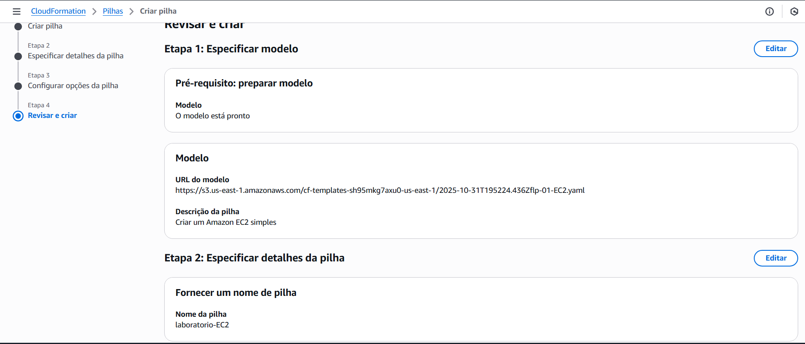
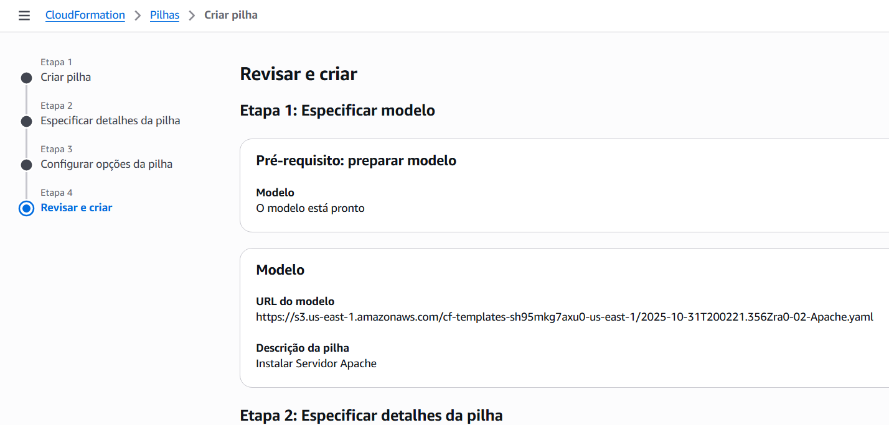
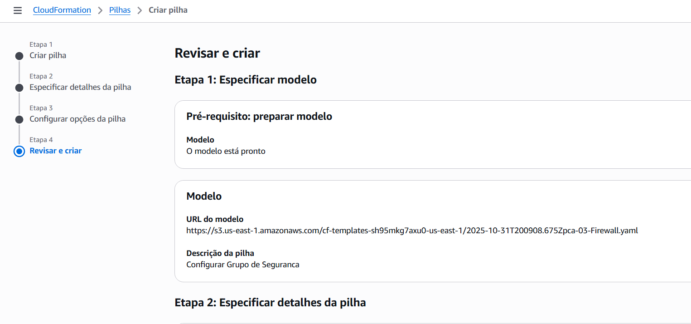
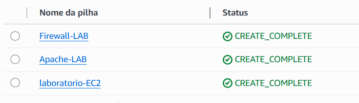

# ☁️ Implementando a Primeira Stack com AWS CloudFormation

Repositório criado como parte do **Módulo 8: Gerenciamento e Governança na AWS - Implementando sua Primeira Stack com AWS CloudFormation** do **Bootcamp Santander Code Girls + DIO**.

Este projeto documenta a prática de criar e validar **stacks** com **AWS CloudFormation**, incluindo templates YAML utilizados e prints do console mostrando o processo de criação da pilha (stack). Serve como material de apoio para estudo e futura referência técnica.

---

## Conceitos Principais

**AWS CloudFormation** é a ferramenta de *Infrastructure as Code* (IaC) da AWS que permite descrever e provisionar infraestrutura usando **templates** em **YAML ou JSON**.  
Com CloudFormation criamos um **template -> executamos -> obtemos uma stack** (conjunto de recursos como EC2, S3, IAM, etc.).

Vantagens:
- Automação e repetibilidade da infraestrutura;  
- Versionamento de templates;  
- Redução de erros manuais;  
- Integração com outros fluxos CI/CD;
- Padronização da infraestrutura e melhor previsibilidade de custos;
- Maior segurança por meio de políticas e regras de acesso configuradas no código.

Principais termos:
- **Template:** arquivo YAML/JSON que descreve recursos.  
- **Stack:** instância criada a partir do template.  
- **Change Set:** pré-visualização de mudanças antes de aplicar.

Outros pontos importantes:
- O YAML é mais utilizado por ser mais simples e legível que JSON.
- Os templates podem ser reutilizados e versionados quantas vezes for necessário.
- Pagamos apenas pelos recursos criados (stacks) e não pela execução do CloudFormation.
- Antes de executar, é essencial definir o desenho da arquitetura (quais recursos serão criados).
- Além do CloudFormation, existem outras ferramentas de IaC como PowerShell, Terraform e AWS SDK.

---

Campos comuns em um template S3 (exemplo):
- **DeletionPolicy:** política para reter ou remover objetos do bucket.  
- **AccessControl:** define o modo de acesso (ex: Private).  
- **LifecycleConfiguration:** regras de ciclo de vida (mover ou remover objetos após X dias).

## Diferença entre CloudFormation e Terraform

| Ferramenta | Características principais |
|-------------|-----------------------------|
| **AWS CloudFormation** | Ferramenta nativa e exclusiva da AWS. Ideal para quem utiliza apenas os serviços da Amazon. Permite automatizar, versionar e gerenciar recursos dentro do ecossistema AWS. |
| **Terraform** | Ferramenta *multicloud*, ou seja, suporta diferentes provedores (AWS, Azure, GCP, entre outros). É mais versátil para ambientes híbridos e facilita migrações entre nuvens. |


HANDS-ON (passos principais):
1. Criar template (YAML/JSON) ou usar template pronto.  
2. Acessar **CloudFormation -> Create stack -> Upload template file**.  
3. Preencher parâmetros (ex: nome da pilha, tipo de instância).  
4. Revisar e criar a pilha.  
5. Acompanhar eventos e validar recursos criados no console (EC2, S3, IAM, etc.).

Observações do laboratório:
- No Template 1: cria uma EC2 com imagem (tive que trocar t2.micro para t3.micro por estar usando uma conta Free Tier).  
- Template 2: instala Apache na EC2.  
- Template 3: configura regras de firewall (security group).
- Exemplo adicional: LAMP STACK -> modelo pronto do AWS que conecta uma EC2 ao MySQL, demonstrando uma aplicação web completa provisionada automaticamente.

---

## Capturas de Tela (prints do hands-on do laboratório)

As imagens abaixo são prints do console do **AWS CloudFormation** durante a criação das pilhas e da listagem dos templates YAML utilizados no laboratório.

### Revisar e criar (01-EC2.yaml)


### Revisar e Criar (02-Apache.yaml)


### Revisar e Criar (03-Firewall.yaml)


### Stacks criadas com templates


---

## Estrutura do repositório

```
CloudFormation-AWS/
│
├── README.md
├── anotacoes-cloudformation.txt
├── templates/
│   ├── 01-EC2.yaml
│   ├── 02-Apache.yaml
│   └── 03-Firewall.yaml
└── images/
    ├── template1.png
    ├── template2.png
    ├── template3certo.png
    └── templatesSucesso.png
```

---

## Créditos

**Autora:** Geovana Maria da Silva Cardoso  
**Bootcamp:** Santander Code Girls + DIO  
**Módulo:** Gerenciamento e Governança na AWS
